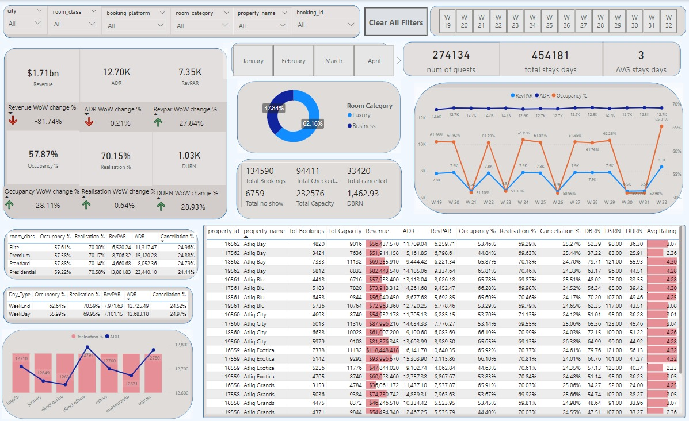

# Hotel Data Analytics - Power BI Dashboard

This project leverages **Power BI** to visualize and analyze hotel booking data. The dashboard provides key performance indicators (KPIs), enabling stakeholders to monitor and optimize hotel performance.

## Power BI Dashboard Interface

### Overview

This dashboard offers a comprehensive view of hotel operations, including revenue, occupancy rates, and booking metrics. The filters and visuals allow users to drill down into data based on various dimensions such as room class, booking platform, and property.

### Key Metrics
- **Revenue**: Total revenue with week-over-week (WoW) change percentages.
- **ADR (Average Daily Rate)**: Room revenue per day.
- **RevPAR (Revenue per Available Room)**: Room revenue across available rooms.
- **Occupancy%**: Room occupancy as a percentage of total capacity.
- **Realization%**: Percentage of total available rooms that were booked.
- **DURN (Duration)**: Average stay duration.

### Visualizations
- **Filterable Metrics**: Filter data by city, room class, platform, and property to gain targeted insights.
- **Pie Chart**: Displays room category distribution (Luxury vs Business).
- **Line Graph**: Tracks trends in **RevPAR**, **ADR**, and **Occupancy%**.
- **Detailed Table**: Provides metrics like **Revenue**, **Occupancy%**, and **RevPAR** for each property.

### Example Metrics and Insights:
- **Occupancy WoW Change**: Up 28.11%
- **Realization WoW Change**: Up 0.64%
- **DURN WoW Change**: Up 28.93%

---

## Power BI Data Warehouse Schema

### Data Model Overview

The data model powering the dashboard consists of fact and dimension tables that store booking and room data. These tables enable the aggregation and calculation of KPIs used in the Power BI reports.

### Fact and Dimension Tables
- **Fact_BookingOperations**: Contains booking operation details (e.g., booking dates, number of guests, stay duration).
- **Fact_Bookings**: Aggregates total bookings and property capacities.
- **Dim_Date**: Stores date attributes (`Day_Type`, `WeekNum`) for time-based filtering.
- **Dim_Rooms**: Contains room-related data (`room_class`, `room_id`).
- **Dim_Hotels**: Includes hotel property data (`city`, `category`, `property_id`).

### Calculated Measures
We have defined multiple calculated measures for tracking business KPIs, including:
- **ADR WoW change %**
- **Occupancy**
- **Revenue**
- **Cancellation%**

These measures support real-time analysis of the hotel performance metrics.

---

## Power BI Integration for Data Analytics

The Power BI dashboard is a crucial tool for analyzing hotel performance. It integrates with our data warehouse, enabling us to calculate and visualize metrics such as revenue, occupancy, cancellations, and more.

---

