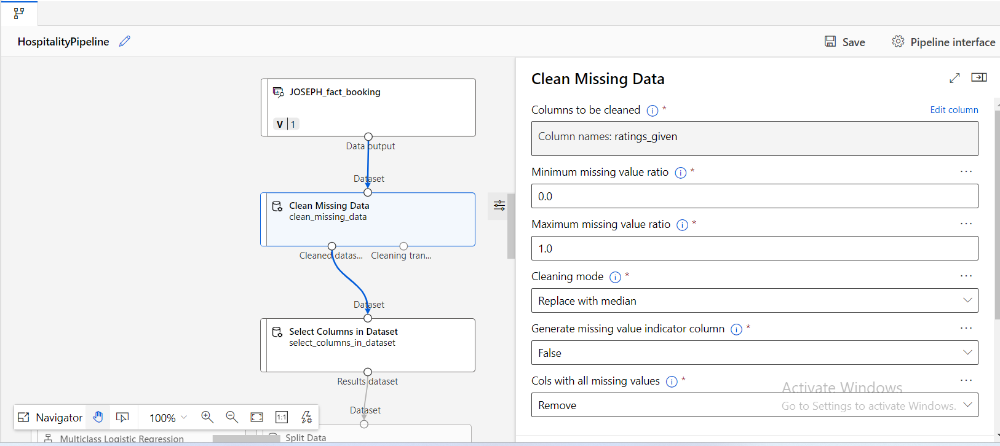
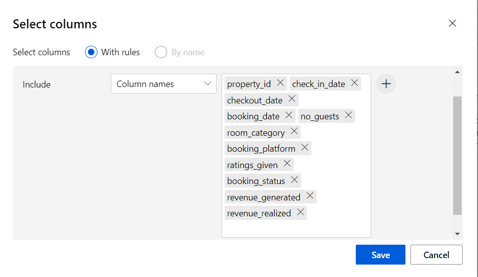
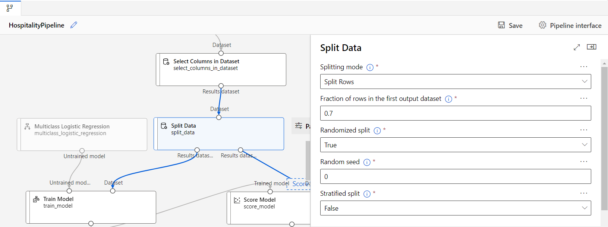
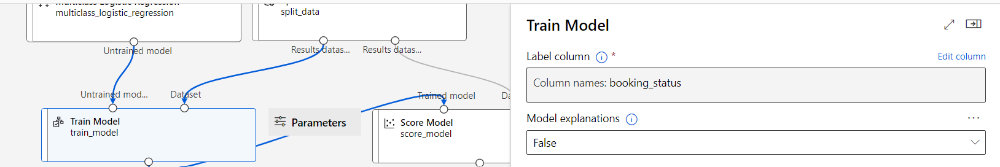
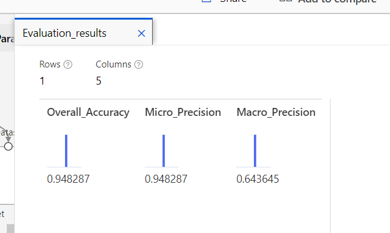

# Booking Prediction Model

## Overview
This project aims to predict customer booking behaviors by classifying them into three categories: 
1. **Booked and Canceled**
2. **Booked and Checked Out**
3. **Booked and Did Not Show**

By analyzing these categories, we can identify potential loyal customers and tailor targeted marketing strategies accordingly.

## Table of Contents
- [DataWareHouse_Design](#DataWareHouse_Design)
- [ETL_Process](#ETL_Process)
- [Azure](#Azure)
- [Data Preparation](#data-preparation)
- [Feature Selection](#feature-selection)
- [Model Selection](#model-selection)
- [Training and Scoring](#training-and-scoring)
- [Evaluation Metrics](#evaluation-metrics)
- [Usage](#usage)
- [Conclusion](#conclusion)
- [License](#license)
## DataWareHouse_Design
This file contains the data warehouse schema design for a hotel booking system. The schema follows a **star schema** model, with fact tables and dimension tables that support efficient queries for booking, property operations, and revenue analysis.
[Read More](Data_WareHouse_Design/ReadMe.md)

## ETL_Process
This project implements an ETL (Extract, Transform, Load) process that extracts data from various file sources, transforms it to fit the desired format, and loads it into a SQL Server database.
[Read More](ETL_Process/ReadMe.md)
## Azure
This project leverages Azure Cloud Services for managing and processing data, integrating data flows into Azure Machine Learning for model building and analytics.
[Read More](Azure/ReadMe.md)
## Data Preparation
In this stage, we focused on ensuring the quality of our data:
- Missing values in the `rating` column were replaced using the median to maintain the integrity of the dataset.

## Feature Selection
We selected specific features to build the model:
- **Features Used**:
  - `property_id`
  - `check_in_date`
  - `checkout_date`
  - `booking_date`
  - `no_guests`
  - `room_category`
  - `booking_platform`
  - `ratings_given`
  - `booking_status`
  - `revenue_generated`
  - `revenue_realized`

- The dataset was split into a training set (70%) and a test set (30%) to validate the model's performance.

## Model Selection
We utilized **Multiclass Logistic Regression** to classify customer behaviors into the three specified categories. This model was chosen for its effectiveness in handling multiclass classification tasks.

## Training and Scoring
- The model was trained using the training dataset to learn patterns and relationships within the data.
- The remaining 30% of the data was used for scoring to evaluate the model's predictive accuracy.

## Evaluation Metrics
To assess the model's performance, we utilized the following metrics:
- **Overall Accuracy**: Measures the proportion of correct predictions.
- **Micro Precision**: Averages precision across all instances, treating them equally.
- **Macro Precision**: Averages precision for each class independently, providing insights into performance on minority classes.

## Usage
To use the model:
1. Clone this repository.

## Conclusion
This project highlights the potential for predicting customer behaviors in the booking industry. By understanding customer patterns, businesses can enhance their marketing strategies and improve customer loyalty.

